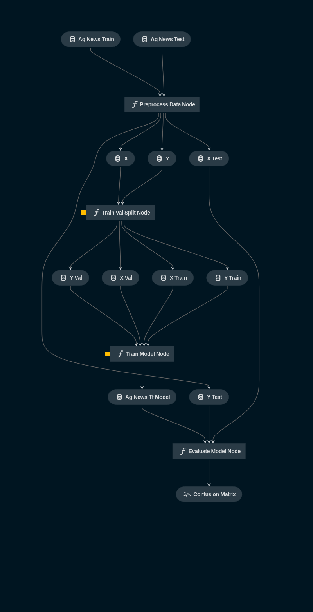

# kedro-agnews-tf
A kedro project for AG News classification task

Kedro is an open source Python framework for creating reproducible, maintainable and modular data science code. It uses best practices of software engineering to build production ready data science pipelines.

## Pipeline Visualization

